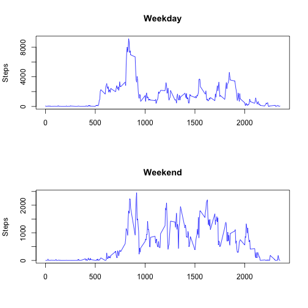

# Reproducible Research: Peer Assessment 1: Step Activity


## Introduction

This is an analysis of data from a personal activity monitoring device.  The device collects data at 5 minute intervals through out the day. The data consists of two months of data from an anonymous individual collected during the months of October and November, 2012 and include the number of steps taken in 5 minute intervals each day.

## Loading and preprocessing the data


```r
steps_df = read.csv("activity.csv")
```


## What is mean total number of steps taken per day?

We create a histogram of the steps taken by per day.


```r
steps_by_day = aggregate(steps_df$steps, list(data = steps_df$date), sum)
hist(steps_by_day$x, breaks = 20, main = "Histogram: Total steps taken each day", 
    xlab = "Steps")
```

 


```r
steps_by_day = aggregate(steps_df$steps, list(data = steps_df$date), sum)
mean(steps_by_day$x, na.rm = TRUE)
```

```
## [1] 10766
```


```r
median(steps_by_day$x, na.rm = TRUE)
```

```
## [1] 10765
```


## What is the average daily activity pattern?


```r
steps_by_interval = aggregate(. ~ interval, data = steps_df, mean)
plot(steps_by_interval$steps, type = "l", main = "Time Series Plot of 5-Min Intervals")
```

 


## Imputing missing values


```r
num_rows = length(steps_df$interval)
num_rows_not_na = length(na.omit(steps_df)$interval)
num_rows_na = num_rows - num_rows_not_na
```


The dataset has 17568 rows, of which 2304 have NAs.


## Filling in Missing Values 

Fill in all missing values in the dataset with mean for an interval that day.  If there is no mean (no data at all for that day), then use mean for the whole dataset.


```r

dataset_mean <- mean(steps_df$steps, na.rm = TRUE)
for (cur_date in unique(steps_df$date)) {
    replace_val <- mean(steps_df$steps[steps_df$date == cur_date], na.rm = TRUE)
    if (is.nan(replace_val)) {
        replace_val = dataset_mean
    }
    steps_df$steps[steps_df$date == cur_date & is.na(steps_df$steps)] <- replace_val
}
```


```r
steps_by_day = aggregate(steps_df$steps, list(data = steps_df$date), sum)
hist(steps_by_day$x, breaks = 20, main = "Histogram: Total steps taken each day")
```

 


```r
num_rows = length(steps_df$interval)
num_rows_not_na = length(na.omit(steps_df)$interval)
num_rows_na = num_rows - num_rows_not_na
```


Dataset with NAs filled in 17568 rows, of which 0 have NAs.

Make a histogram of the total number of steps taken each day and Calculate and report the mean and median total number of steps taken per day. Do these values differ from the estimates from the first part of the assignment? What is the impact of imputing missing data on the estimates of the total daily number of steps?

FINISH ME


```r
steps_df = read.csv("activity.csv")
steps_by_day = aggregate(steps_df$steps, list(data = steps_df$date), sum)
hist(steps_by_day$x, breaks = 20, main = "Histogram: Total steps taken each day, with filled in data")
```

 


## Are there differences in activity patterns between weekdays and weekends?

First we create a factor variable *weekday* to store the day-of-week for the given interval which 
stores either *Weekend* or *Weekday* for each row.


```r
steps_df$day_of_week <- weekdays(as.Date(steps_df$date, "%Y-%m-%d"))
steps_df$weekday <- ifelse(steps_df$day_of_week == "Saturday" | steps_df$day_of_week == 
    "Sunday", "Weekend", "Weekday")
```


We can then create a plot of a 5-minute interval (x-axis) and the average number of steps taken, averaged across all weekday days or weekend days (y-axis).


```r

par(mfrow = c(2, 1))

steps_weekday_df = steps_df[steps_df$weekday == "Weekday", ]
steps_by_interval_weekday = aggregate(steps_weekday_df$steps ~ steps_weekday_df$interval, 
    data = steps_weekday_df, sum)
plot(steps_by_interval_weekday, type = "l", main = "Weekday", ylab = "Steps", 
    xlab = "", col = "blue")

steps_weekend_df = steps_df[steps_df$weekday == "Weekend", ]
steps_by_interval_weekend = aggregate(steps_weekend_df$steps ~ steps_weekend_df$interval, 
    data = steps_weekend_df, sum)
plot(steps_by_interval_weekend, type = "l", main = "Weekend", ylab = "Steps", 
    xlab = "", col = "blue")
```

 


